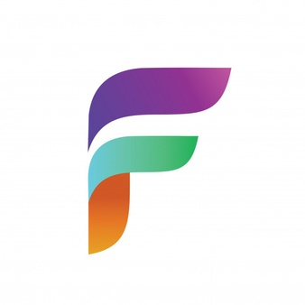

  

  <h3 align="center">VsFiglet</h3>

  

    Generate ASCII Doc right from vscode.
     
    <a href="https://github.com/srilakshmikanthnap/vsfiglet/issues">Report Bug</a>
    ·
    <a href="https://github.com/srilakshmikanthnap/vsfiglet/issues">Request Feature</a>
  

<!-- TABLE OF CONTENTS -->

  
<h2 style="display: inline-block">Table of Contents</h2>

  <ol>
    <li>
      <a href="#about-the-project">About The Project</a>
    </li>
    <li>
      <a href="#getting-started">Getting Started</a>
      <ul>
        <li><a href="#installation">Installation</a></li>
      </ul>
    </li>
    <li><a href="#usage">Usage</a></li>
    <li><a href="#contributing">Contributing</a></li>
    <li><a href="#license">License</a></li>
    <li><a href="#contact">Contact</a></li>
  </ol>

<!-- ABOUT THE PROJECT -->
## About The Project

This is a simple extension that allows you to use Figlet in your code. Use this to create an attractive ASCII doc inside your code.

<!-- GETTING STARTED -->
## Getting Started

To install the extension follow these simple steps.

### Installation

Install from the [marketplace](https://marketplace.visualstudio.com/items?itemName=srilakshmikanthanp.vsfiglet).

<!-- USAGE EXAMPLES -->
## Usage

<!-- CONTRIBUTING -->
## Contributing

Contributions are what make the open source community such an amazing place to learn, inspire, and create. Any contributions you make are **greatly appreciated**.

1. Fork the Project
2. Create your Feature Branch (`git checkout -b feature/AmazingFeature`)
3. Commit your Changes (`git commit -m 'Add some AmazingFeature'`)
4. Push to the Branch (`git push origin feature/AmazingFeature`)
5. Open a Pull Request

<!-- LICENSE -->
## License

Distributed under the MIT License. See `LICENSE` for more information.

<!-- CONTACT -->
## Contact

Project Link: [https://github.com/srilakshmikanthnap/vsfiglet](https://github.com/srilakshmikanthnap/vsfiglet)
